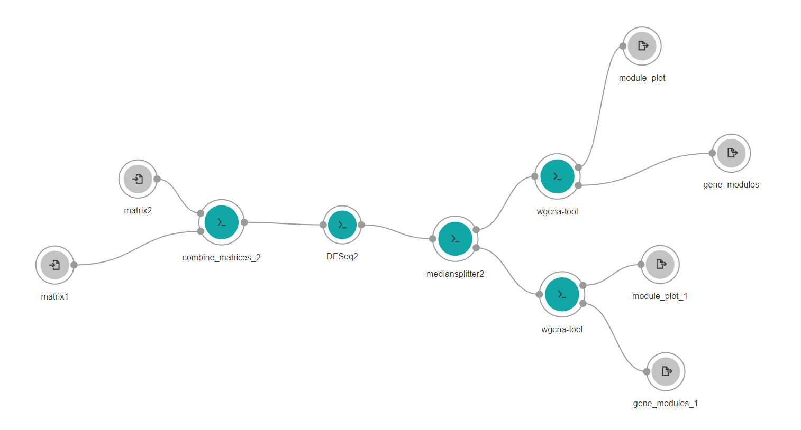

# MYC-Amplification-in-Congenital-Heart-Disease-and-Cancer-in-Kids-First-and-INCLUDE-Data-Set

Using the [Elements of Style in Workflow](https://github.com/NIH-NICHD/Kids-First-Elements-of-Style-Workflow-Creation-Maintenance) creation approach as taught in the https://nih-nichd.github.io, the team will work together to containerize the processing steps and stitch them together in a workflow language.   On [Cavatica](https://www.cavatica.org/), the workflow language best supported is [Common Workflow Language (CWL)](https://www.commonwl.org/).

|      |        |
| ------------- | --------------------------------------------------------------------------- |
|  |   |

|              |
| ------------ |
|  |

## Background
[Hackathon Report Out Slides](https://docs.google.com/presentation/d/1Imgrt_5ixc_17GnOkm1iBAEA8SeTevZ3ZVW117u0X9I/edit#slide=id.g244fa5fce02_11_8)

MYC is an oncoprotein and often implies worse outcomes, however, it also seems to have a role in cardiovascular disease. Using open data from both the INCLUDE Data Hub and the Kids First (KF) Data Resource Portal available through the Cavatica Platform, this Hackathon will:

* Explore MYC expression and its segregating effects at the intersection of A) congenital heart defects and cancer from KF & B) & Down Syndrome (Include)

* Build platform agnostic workflows and analysis notebooks using the elements of style method (https://nih-nichd.github.io) that will use both WGCNA and limma to probe the dual role of this gene.

* Result in a tutorial of how to proceed from both https://portal.includedcc.org/ and https://portal.kidsfirstdrc.org to https://cavatica.sbgenomics.com/ as well as produce results in notebooks that could be used as figures in a paper promoting open transparent, reproducible results.

## Moving from Portal to Platform …

1. Make two matrices of gene x sample in Cavatica Portal -- in our case the Kids First RNA-seq workflow (pre-made by CHOP).
2. Combine expression matrices for birth defects and cancer.
3. Normalize gene expression with deseq2 (not using for differential expression, only for quantile normalisation).
4. Separate the samples between high and low MYC expression using Gene Median Splitter.
5. Classify all subjects by phenotype.
6. Run WGNCA analysis after binning  based on High MYC and Low MYC expression.
7. Create a template jupyter lab notebook https://bioinformaticsworkbook.org/tutorials/wgcna.html#gsc.tab=0). 
8. Look at congenital and cardiac outcomes that might be due to drug interactions. *Related Repo for [MYC related pediatric drug saftey profiles](https://github.com/BioITHackathons/myc-related-pediatric-drug-safety-profiles)
9. What are some outcome differences between high and low MYC expression; different heart morphologies, birth defects based on HPO terms.
10. Run annotation analysis such as GO and biological pathways, maybe Reactome.

Workflow Diagram:

  

Analysis plan - Weighted Gene Co-expression Network Analysis (WGCNA) [*See Publication*](https://bmcbioinformatics.biomedcentral.com/articles/10.1186/1471-2105-9-559) exists as an R program -> convert to a notebook -> break out the DESeq from the WGCNA

Treatment in the WGCNA sense is the condition of the sample:
* Trisomy and Disomy samples
* High Myc and Low Myc expression.  
* Birth defect (cardiac) and Blood Cancers
* Birth Defect (cardiac) and Solid Tumors

## Docker Files for Project

[Docker File for WGCNA](https://github.com/NIH-NICHD/wgcna-docker)

[Docker File for Gene Median Classifier](https://github.com/NIH-NICHD/gene-median-splitter-docker)

[Docker File for DeSeq2](https://github.com/NIH-NICHD/deseq2-docker)

